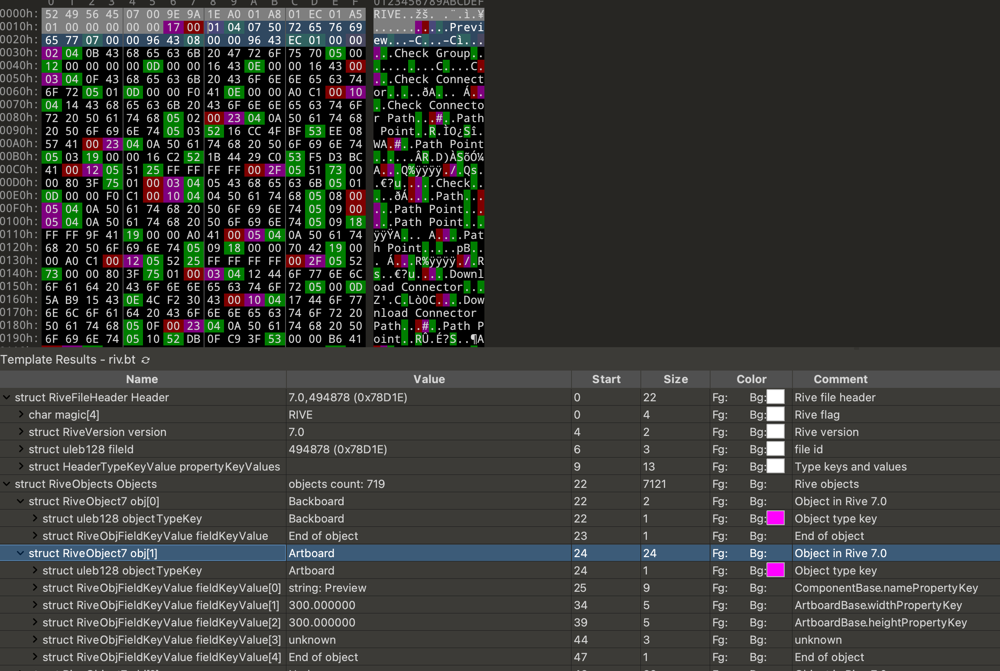

# rive

我这里解析的是 rive.app 提供的导出文件 riv 格式，版本号是 7.0（后面解释这个版本号）

## 什么是 rive

这个结构是 rive.app 的数据结构，它是一个二进制文件，是一个动画库，可以在 flutter 中使用。
当然，按照官方给定的一些开源库，它应该也支持react、wasm、react-native、android、iOS

另外，官方开源的仓库按名称看，还支持了 c# 和 c++，但是不知道是对应的什么 UI 框架，还是单纯的语言结构。

## 说明

目前没有看到官方文档来解释这个格式，所以只能自己去研究了。也可能因为他们希望收费所有没有提供？

另外，因为类型极多，所以我这里不解析具体的类型和对应的视线效果，仅仅解析出数据结构，以便于在 010 editor 这样的管理器中来找到对应的结构。

然后，我是基于 rive-flutter 库的源码来做的解析，其他语言的解析结果我没有验证过。

## 文件解构

基于源码分析，文件主要有2个部分组成，一个是头部，一个是数据部分。

和其他一些文件的结构不同，riv文件中不提供任何偏移量，所以只能顺序读取。

基础的读取文件的代码，我仅做简单分析，且只基于当前版本的文件格式，后续版本的文件格式可能会有变化。
对应的 rive 版本是 0.11.15，对应的文件格式版本是 7.0。

### BinaryReader

这个文件是 rive 中定义的，用于读取二进制文件。

文件是 [rive_common][] 提供的，但是这个库本身只上传到了 pub.dev，而不在 github 上，所以我这里直接把代码贴出来了。

<details>

<summary>BinaryReader</summary>

```dart

class BinaryReader {
  final _utf8Decoder = const Utf8Decoder();
  final ByteData buffer;
  final Endian endian;

  /// TODO: remove setter for readIndex when we remove _readVarInt from
  /// core_double_type.dart
  int readIndex = 0;

  int get position => readIndex;

  BinaryReader(this.buffer, {this.endian = Endian.little});

  BinaryReader.fromList(Uint8List list, {this.endian = Endian.little})
      : buffer =
            ByteData.view(list.buffer, list.offsetInBytes, list.lengthInBytes);

  bool get isEOF => readIndex >= buffer.lengthInBytes;

  double readFloat32() {
    double value = buffer.getFloat32(readIndex, endian);
    readIndex += 4;
    return value;
  }

  double readFloat64() {
    double value = buffer.getFloat64(readIndex, endian);
    readIndex += 8;
    return value;
  }

  int readInt8() {
    int value = buffer.getInt8(readIndex);
    readIndex += 1;
    return value;
  }

  int readUint8() {
    int value = buffer.getUint8(readIndex);
    readIndex += 1;
    return value;
  }

  int readInt16() {
    int value = buffer.getInt16(readIndex, endian);
    readIndex += 2;
    return value;
  }

  int readUint16() {
    int value = buffer.getUint16(readIndex, endian);
    readIndex += 2;
    return value;
  }

  int readInt32() {
    int value = buffer.getInt32(readIndex, endian);
    readIndex += 4;
    return value;
  }

  int readUint32() {
    int value = buffer.getUint32(readIndex, endian);
    readIndex += 4;
    return value;
  }

  int readInt64() {
    int value = buffer.getInt64(readIndex, endian);
    readIndex += 8;
    return value;
  }

  int readUint64() {
    int value = buffer.getUint64(readIndex, endian);
    readIndex += 8;
    return value;
  }

  /// Read a variable length unsigned integer from the buffer encoded as an
  /// LEB128 unsigned integer.
  int readVarUint() {
    int result = 0;
    int shift = 0;
    while (true) {
      int byte = buffer.getUint8(readIndex++) & 0xff;
      result |= (byte & 0x7f) << shift;
      if ((byte & 0x80) == 0) break;
      shift += 7;
    }
    return result;
  }

  /// Read a string encoded into the stream. Strings are encoded with a varuint
  /// integer length written first followed by length number of utf8 encoded
  /// bytes.
  String readString({bool explicitLength = true}) {
    int length = explicitLength ? readVarUint() : buffer.lengthInBytes;
    String value = _utf8Decoder.convert(Uint8List.view(
        buffer.buffer, buffer.offsetInBytes + readIndex, length));
    readIndex += length;
    return value;
  }

  Uint8List read(int length, [bool allocNew = true]) {
    var view =
        Uint8List.view(buffer.buffer, buffer.offsetInBytes + readIndex, length);
    readIndex += length;
    return allocNew ? Uint8List.fromList(view) : view;
  }
}
```

</details>

这个文件就是按偏移量读取一个 buffer 中的数据，读取后则会更新偏移量。

其中需要注意的就是两个方法，一个是 `readVarUint`，一个是 `readString`。

`readVarUint` 是读取一个变长的无符号整数，它的实现是按照 [uleb128][] 来实现的。中文说明则可以参考 [uleb128-android][]。
和 [uleb128-android][] 不同的是，这里的实现不仅仅局限于 32 位，而是只要单字节的最高位是1，就会继续读取，直到某字节的最高位为0为止。

`readString` 是读取一个字符串，它比较特殊的一点是带有一个参数，这个参数决定了读取多少个字节的字符串。
如果这个参数为 true，则会先读取一个变长的无符号整数，然后再读取对应长度的字符串。如果这个参数为 false，则会读取整个 buffer 中的字符串。
一般来说，这个参数应该总为 true。

### 头部

<details>

<summary>RuntimeHeader</summary>

```dart
 /// Read the header from a binary [reader]. Specify [version] to check
  /// compatibility while loading the header. You can also opt to provide null
  /// to skip version checking. Note that in this case the header can only be
  /// read if it's of a known major version (<= [riveVersion.major]).
  factory RuntimeHeader.read(
    BinaryReader reader, {
    RuntimeVersion? version = riveVersion,
  }) {
    var fingerprint = RuntimeHeader.fingerprint.codeUnits;

    for (int i = 0; i < fingerprint.length; i++) {
      if (reader.readUint8() != fingerprint[i]) {
        throw const RiveFormatErrorException('Fingerprint doesn\'t match.');
      }
    }

    int readMajorVersion = reader.readVarUint();
    int readMinorVersion = reader.readVarUint();

    if (version == null && readMajorVersion > riveVersion.major) {
      throw RiveUnsupportedVersionException(riveVersion.major,
          riveVersion.minor, readMajorVersion, readMinorVersion);
    } else if (version != null && readMajorVersion != version.major) {
      throw RiveUnsupportedVersionException(
          version.major, version.minor, readMajorVersion, readMinorVersion);
    }
    if (readMajorVersion == 6) {
      reader.readVarUint();
    }
    int fileId = reader.readVarUint();

    var propertyFields = HashMap<int, int>();

    var propertyKeys = <int>[];
    for (int propertyKey = reader.readVarUint(); propertyKey != 0; propertyKey = reader.readVarUint()) {
      propertyKeys.add(propertyKey);
    }
    int currentInt = 0;
    int currentBit = 8;
    for (final propertyKey in propertyKeys) {
      if (currentBit == 8) {
        currentInt = reader.readUint32();
        currentBit = 0;
      }
      int fieldIndex = (currentInt >> currentBit) & 3;
      propertyFields[propertyKey] = fieldIndex;
      currentBit += 2;
    }

    return RuntimeHeader(
      fileId: fileId,
      version: RuntimeVersion(readMajorVersion, readMinorVersion),
      propertyToFieldIndex: propertyFields,
    );
  }
```

</details>

根据代码来看，目前的版本号是 7.0，并且 flutter 部分的代码看起来只支持 7.x 的 major 版本。

一个典型的头部是这样组成的。

| 字段 | 类型 | 大小 | 说明 |
| --- | --- | --- | --- |
| magic | char 数组 | 4 | 固定为 `RIVE` 的大写格式 |
| version | 两个可变 uleb128 | 可变 | 第一个是主版本号，第二个是次版本号 |
| fileId | uleb128 | 可变 | 文件 id |
| typeKeys | uleb128 *n | 可变 *n | 类型 key 的数量 |
| typeValues | 类型 key 的数量 | 可变 *n | 类型 key 的值 |

### object 部分

[解析的代码逻辑](https://github.com/rive-app/rive-flutter/blob/c6791d7b6dc994f45091836dbd8708a09ab23eee/lib/src/rive_file.dart#L44-L74)

按照代码定义，object 部分是这样的。

| 字段 | 类型 | 大小 | 说明 |
| --- | --- | --- | --- |
| type | uleb128 | 可变 | object type key |
| property key values | uleb128 *n | 可变 *n | 属性对应的键值对 |

当且仅当 type 为 0 时，表示这个 object 结束，[这部分的代码][type-int-to-type-name]。

简单来说，一个 object 会包含一个用于标识 object 类型的 type key，然后是该 object 包含的的属性 key 和属性值。

属性方面，它的 property-key 是一个 uleb128，它的值则根据 property-key 来决定是什么类型，
dart 中 将这个值称为 [CoreFieldType][core-type-to-value-type]。
值主要有以下几种类型：

| 值 | 类型 | 说明
| --- | --- | --- |
| string | uleb128 + string | 先读取一个 uleb128 作为字符串的长度，然后再读取对应的字节数转为字符串 |
| bytes | uleb128 + bytes | 先读取一个 uleb128 作为字节数组的长度，然后再读取对应的字节数组 |
| uint | uleb128 | 读取一个 uleb128 作为无符号整数 |
| double | double | 读取一个 32 位的浮点数 （4个字节）|
| bool | bool | 读取一个字节，如果是 1 则为 true，否则为 false |
| color | uint32 | 读取一个 32 位的无符号整数，表示颜色，理论上是对应的 ARGB |

有一个额外的说明，就是如果对应的 propertyKey 为 null，则依然需要

### 典型的文件截图



[rive_common]: https://pub.dev/packages/rive_common
[uleb128]: https://en.wikipedia.org/wiki/LEB128
[uleb128-android]: https://source.android.com/docs/core/runtime/dex-format?hl=zh-cn
[type-int-to-type-name]: https://github.com/rive-app/rive-flutter/blob/c6791d7b6dc994f45091836dbd8708a09ab23eee/lib/src/generated/rive_core_context.dart#L147-L362
[core-type-to-value-type]: https://github.com/rive-app/rive-flutter/blob/c6791d7b6dc994f45091836dbd8708a09ab23eee/lib/src/generated/rive_core_context.dart#L1651-L1919
