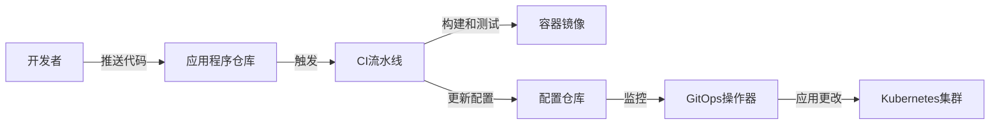

# Kubernetes CI/CD与GitOps

在现代软件开发中，持续集成和持续部署（CI/CD）是提高软件交付速度和质量的关键实践。GitOps则是一种以Git作为单一事实来源的操作模型，用于自动化Kubernetes集群的配置和应用程序部署。本文将深入探讨Kubernetes中的CI/CD与GitOps实践，包括Jenkins与Kubernetes集成、Tekton流水线、ArgoCD/FluxCD实现GitOps以及Helm包管理。

## Jenkins与Kubernetes集成

Jenkins是最流行的开源CI/CD工具之一，可以与Kubernetes无缝集成，实现自动化构建、测试和部署。

### 在Kubernetes中部署Jenkins

使用Helm是部署Jenkins的简单方法：

```bash
# 添加Jenkins Helm仓库
helm repo add jenkins https://charts.jenkins.io

# 更新仓库
helm repo update

# 安装Jenkins
helm install jenkins jenkins/jenkins
```

或者使用YAML清单文件：

```yaml
apiVersion: apps/v1
kind: Deployment
metadata:
  name: jenkins
  namespace: jenkins
spec:
  replicas: 1
  selector:
    matchLabels:
      app: jenkins
  template:
    metadata:
      labels:
        app: jenkins
    spec:
      serviceAccountName: jenkins
      containers:
      - name: jenkins
        image: jenkins/jenkins:lts
        ports:
        - containerPort: 8080
        volumeMounts:
        - name: jenkins-home
          mountPath: /var/jenkins_home
      volumes:
      - name: jenkins-home
        persistentVolumeClaim:
          claimName: jenkins-pvc
---
apiVersion: v1
kind: Service
metadata:
  name: jenkins
  namespace: jenkins
spec:
  type: NodePort
  ports:
  - port: 8080
    targetPort: 8080
  selector:
    app: jenkins
```

### Jenkins Kubernetes插件

Jenkins Kubernetes插件允许Jenkins使用Kubernetes Pod作为动态代理，实现更高效的构建过程。

#### 配置Kubernetes插件

1. 安装Kubernetes插件：在Jenkins管理界面 > 插件管理 > 可用插件中搜索"Kubernetes"并安装
2. 配置Kubernetes云：在Jenkins管理界面 > 系统配置 > 云 > 添加新云 > Kubernetes
3. 配置Kubernetes连接信息：
   - Kubernetes URL：`https://kubernetes.default.svc`
   - Kubernetes命名空间：`jenkins`
   - 凭据：选择或添加Kubernetes服务账户凭据
4. 配置Pod模板：
   - 名称：`jenkins-agent`
   - 命名空间：`jenkins`
   - 容器模板：
     - 名称：`jnlp`
     - Docker镜像：`jenkins/inbound-agent:4.11.2-4`
     - 工作目录：`/home/jenkins/agent`

### Jenkins Pipeline与Kubernetes

Jenkins Pipeline是一组插件，支持在Jenkins中实现和集成持续交付流水线。

#### Jenkinsfile示例

```groovy
pipeline {
    agent {
        kubernetes {
            yaml """
apiVersion: v1
kind: Pod
spec:
  containers:
  - name: maven
    image: maven:3.8.4-openjdk-11
    command:
    - cat
    tty: true
  - name: docker
    image: docker:20.10.12-dind
    command:
    - cat
    tty: true
    volumeMounts:
    - name: docker-sock
      mountPath: /var/run/docker.sock
  volumes:
  - name: docker-sock
    hostPath:
      path: /var/run/docker.sock
"""
        }
    }
    stages {
        stage('Build') {
            steps {
                container('maven') {
                    sh 'mvn clean package'
                }
            }
        }
        stage('Build and Push Docker Image') {
            steps {
                container('docker') {
                    sh 'docker build -t my-app:${BUILD_NUMBER} .'
                    sh 'docker push my-app:${BUILD_NUMBER}'
                }
            }
        }
        stage('Deploy to Kubernetes') {
            steps {
                container('docker') {
                    sh 'kubectl apply -f kubernetes/deployment.yaml'
                    sh 'kubectl set image deployment/my-app my-app=my-app:${BUILD_NUMBER}'
                }
            }
        }
    }
}
```

### Jenkins X

Jenkins X是一个基于Jenkins和Kubernetes的CI/CD解决方案，专为云原生应用程序设计。

```bash
# 安装jx CLI
brew install jenkins-x/jx/jx

# 创建Jenkins X集群
jx create cluster gke --cluster-name=my-jx-cluster

# 导入现有项目
jx import --url=https://github.com/myorg/myapp.git
```

## Tekton流水线

Tekton是一个强大且灵活的Kubernetes原生CI/CD框架，提供了一组标准的构建块来构建CI/CD系统。

### Tekton架构

Tekton由以下核心组件组成：

1. **Task**：定义一系列步骤，每个步骤在一个容器中执行
2. **TaskRun**：Task的执行实例
3. **Pipeline**：定义一系列Task及其执行顺序和依赖关系
4. **PipelineRun**：Pipeline的执行实例
5. **PipelineResource**：定义Pipeline输入和输出资源

### 安装Tekton

```bash
# 安装Tekton Pipelines
kubectl apply -f https://storage.googleapis.com/tekton-releases/pipeline/latest/release.yaml

# 安装Tekton Dashboard
kubectl apply -f https://storage.googleapis.com/tekton-releases/dashboard/latest/tekton-dashboard-release.yaml

# 安装Tekton CLI
brew install tektoncd-cli
```

### Tekton Task示例

```yaml
apiVersion: tekton.dev/v1beta1
kind: Task
metadata:
  name: build-app
spec:
  params:
  - name: git-url
    type: string
    description: Git repository URL
  - name: git-revision
    type: string
    description: Git revision to checkout
    default: main
  workspaces:
  - name: source
  steps:
  - name: git-clone
    image: alpine/git:v2.26.2
    script: |
      git clone $(params.git-url) $(workspaces.source.path)/source
      cd $(workspaces.source.path)/source
      git checkout $(params.git-revision)
  - name: build
    image: maven:3.8.4-openjdk-11
    workingDir: $(workspaces.source.path)/source
    script: |
      mvn clean package
```

### Tekton Pipeline示例

```yaml
apiVersion: tekton.dev/v1beta1
kind: Pipeline
metadata:
  name: build-and-deploy
spec:
  params:
  - name: git-url
    type: string
  - name: git-revision
    type: string
    default: main
  - name: image-name
    type: string
  workspaces:
  - name: shared-workspace
  tasks:
  - name: build
    taskRef:
      name: build-app
    params:
    - name: git-url
      value: $(params.git-url)
    - name: git-revision
      value: $(params.git-revision)
    workspaces:
    - name: source
      workspace: shared-workspace
  - name: build-image
    taskRef:
      name: build-docker-image
    runAfter:
    - build
    params:
    - name: image-name
      value: $(params.image-name)
    workspaces:
    - name: source
      workspace: shared-workspace
  - name: deploy
    taskRef:
      name: deploy-to-kubernetes
    runAfter:
    - build-image
    params:
    - name: image-name
      value: $(params.image-name)
    workspaces:
    - name: source
      workspace: shared-workspace
```

### 运行Tekton Pipeline

```yaml
apiVersion: tekton.dev/v1beta1
kind: PipelineRun
metadata:
  name: build-and-deploy-run
spec:
  pipelineRef:
    name: build-and-deploy
  params:
  - name: git-url
    value: https://github.com/myorg/myapp.git
  - name: git-revision
    value: main
  - name: image-name
    value: myorg/myapp:latest
  workspaces:
  - name: shared-workspace
    persistentVolumeClaim:
      claimName: pipeline-pvc
```

### Tekton触发器

Tekton Triggers允许你基于事件（如Git提交或PR）自动触发Pipeline。

```yaml
apiVersion: triggers.tekton.dev/v1alpha1
kind: TriggerTemplate
metadata:
  name: build-deploy-template
spec:
  params:
  - name: git-url
    description: Git repository URL
  - name: git-revision
    description: Git revision
  resourcetemplates:
  - apiVersion: tekton.dev/v1beta1
    kind: PipelineRun
    metadata:
      generateName: build-deploy-run-
    spec:
      pipelineRef:
        name: build-and-deploy
      params:
      - name: git-url
        value: $(tt.params.git-url)
      - name: git-revision
        value: $(tt.params.git-revision)
      - name: image-name
        value: myorg/myapp:$(tt.params.git-revision)
      workspaces:
      - name: shared-workspace
        persistentVolumeClaim:
          claimName: pipeline-pvc
---
apiVersion: triggers.tekton.dev/v1alpha1
kind: TriggerBinding
metadata:
  name: github-binding
spec:
  params:
  - name: git-url
    value: $(body.repository.url)
  - name: git-revision
    value: $(body.head_commit.id)
---
apiVersion: triggers.tekton.dev/v1alpha1
kind: EventListener
metadata:
  name: github-listener
spec:
  serviceAccountName: tekton-triggers-sa
  triggers:
  - name: github-trigger
    bindings:
    - ref: github-binding
    template:
      ref: build-deploy-template
```

## ArgoCD/FluxCD实现GitOps

GitOps是一种操作模型，使用Git作为声明式基础设施和应用程序的单一事实来源。ArgoCD和FluxCD是两个流行的GitOps工具，用于自动化Kubernetes集群的配置和应用程序部署。

### GitOps原则

GitOps基于以下核心原则：

1. **声明式配置**：系统的期望状态在Git中声明式地定义
2. **版本控制和历史**：所有更改都通过Git版本控制，提供完整的审计跟踪
3. **自动化同步**：系统自动将Git中的声明式配置应用到生产环境
4. **持续协调**：系统持续监控实际状态并将其与期望状态进行协调

### ArgoCD

ArgoCD是一个声明式、GitOps持续交付工具，用于Kubernetes。

#### 安装ArgoCD

```bash
# 创建ArgoCD命名空间
kubectl create namespace argocd

# 安装ArgoCD
kubectl apply -n argocd -f https://raw.githubusercontent.com/argoproj/argo-cd/stable/manifests/install.yaml

# 获取ArgoCD管理员密码
kubectl -n argocd get secret argocd-initial-admin-secret -o jsonpath="{.data.password}" | base64 -d

# 安装ArgoCD CLI
brew install argocd
```

#### ArgoCD应用程序示例

```yaml
apiVersion: argoproj.io/v1alpha1
kind: Application
metadata:
  name: guestbook
  namespace: argocd
spec:
  project: default
  source:
    repoURL: https://github.com/argoproj/argocd-example-apps.git
    targetRevision: HEAD
    path: guestbook
  destination:
    server: https://kubernetes.default.svc
    namespace: guestbook
  syncPolicy:
    automated:
      prune: true
      selfHeal: true
    syncOptions:
    - CreateNamespace=true
```

#### ArgoCD项目示例

```yaml
apiVersion: argoproj.io/v1alpha1
kind: AppProject
metadata:
  name: my-project
  namespace: argocd
spec:
  description: My Project
  sourceRepos:
  - https://github.com/myorg/*
  destinations:
  - namespace: my-namespace
    server: https://kubernetes.default.svc
  clusterResourceWhitelist:
  - group: '*'
    kind: '*'
  namespaceResourceBlacklist:
  - group: ''
    kind: ResourceQuota
  - group: ''
    kind: LimitRange
  - group: ''
    kind: NetworkPolicy
  roles:
  - name: developer
    description: Developer role
    policies:
    - p, proj:my-project:developer, applications, get, my-project/*, allow
    - p, proj:my-project:developer, applications, sync, my-project/*, allow
```

### FluxCD

FluxCD是另一个GitOps工具，专注于自动化Kubernetes集群的配置和应用程序部署。

#### 安装FluxCD

```bash
# 安装Flux CLI
brew install fluxcd/tap/flux

# 检查集群是否准备好安装Flux
flux check --pre

# 引导Flux安装
flux bootstrap github \
  --owner=myorg \
  --repository=my-flux-repo \
  --branch=main \
  --path=clusters/my-cluster \
  --personal
```

#### FluxCD源示例

```yaml
apiVersion: source.toolkit.fluxcd.io/v1beta1
kind: GitRepository
metadata:
  name: my-app
  namespace: flux-system
spec:
  interval: 1m
  url: https://github.com/myorg/my-app
  ref:
    branch: main
```

#### FluxCD Kustomization示例

```yaml
apiVersion: kustomize.toolkit.fluxcd.io/v1beta1
kind: Kustomization
metadata:
  name: my-app
  namespace: flux-system
spec:
  interval: 5m
  path: ./kubernetes
  prune: true
  sourceRef:
    kind: GitRepository
    name: my-app
  validation: client
  healthChecks:
  - apiVersion: apps/v1
    kind: Deployment
    name: my-app
    namespace: default
```

### GitOps工作流

典型的GitOps工作流包括以下步骤：

1. **开发者推送代码**：开发者将代码更改推送到应用程序仓库
2. **CI流水线构建和测试**：CI流水线（如Jenkins或Tekton）构建和测试应用程序
3. **更新配置仓库**：CI流水线更新配置仓库中的镜像标签或其他配置
4. **GitOps操作器同步**：GitOps操作器（如ArgoCD或FluxCD）检测配置更改并将其应用到集群



### GitOps最佳实践

1. **环境分离**：为不同环境（开发、测试、生产）使用不同的配置分支或目录
2. **基础设施即代码**：使用Terraform、Pulumi等工具以代码形式定义基础设施
3. **密钥管理**：使用Sealed Secrets、Vault等工具安全地管理密钥
4. **渐进式交付**：实施蓝绿部署、金丝雀发布等策略
5. **自动化策略验证**：使用OPA Gatekeeper、Kyverno等工具验证配置符合策略

## Helm包管理

Helm是Kubernetes的包管理器，简化了应用程序的部署和管理。

### Helm架构

Helm由以下组件组成：

1. **Helm CLI**：用于创建、打包、配置和管理Helm图表的命令行工具
2. **图表（Chart）**：预配置的Kubernetes资源包
3. **发布（Release）**：在Kubernetes集群中运行的图表实例
4. **仓库（Repository）**：存储和共享图表的地方

### 安装Helm

```bash
# 使用Homebrew安装Helm
brew install helm

# 或使用脚本安装
curl https://raw.githubusercontent.com/helm/helm/main/scripts/get-helm-3 | bash
```

### 使用Helm图表

```bash
# 添加Helm仓库
helm repo add stable https://charts.helm.sh/stable

# 更新仓库
helm repo update

# 搜索图表
helm search repo nginx

# 安装图表
helm install my-nginx stable/nginx-ingress

# 自定义值安装
helm install my-nginx stable/nginx-ingress --set controller.replicaCount=2

# 使用值文件安装
helm install my-nginx stable/nginx-ingress -f values.yaml

# 升级发布
helm upgrade my-nginx stable/nginx-ingress --set controller.replicaCount=3

# 回滚发布
helm rollback my-nginx 1

# 卸载发布
helm uninstall my-nginx
```

### 创建自定义Helm图表

```bash
# 创建新图表
helm create my-app

# 图表目录结构
my-app/
  Chart.yaml          # 图表元数据
  values.yaml         # 默认配置值
  templates/          # 模板目录
    deployment.yaml   # Kubernetes Deployment模板
    service.yaml      # Kubernetes Service模板
    _helpers.tpl      # 模板助手函数
  charts/             # 依赖图表
  .helmignore         # 忽略文件模式

# 打包图表
helm package my-app

# 安装本地图表
helm install my-release ./my-app
```

### Helm模板示例

```yaml
# templates/deployment.yaml
apiVersion: apps/v1
kind: Deployment
metadata:
  name: {{ include "my-app.fullname" . }}
  labels:
    {{- include "my-app.labels" . | nindent 4 }}
spec:
  replicas: {{ .Values.replicaCount }}
  selector:
    matchLabels:
      {{- include "my-app.selectorLabels" . | nindent 6 }}
  template:
    metadata:
      labels:
        {{- include "my-app.selectorLabels" . | nindent 8 }}
    spec:
      containers:
      - name: {{ .Chart.Name }}
        image: "{{ .Values.image.repository }}:{{ .Values.image.tag | default .Chart.AppVersion }}"
        imagePullPolicy: {{ .Values.image.pullPolicy }}
        ports:
        - name: http
          containerPort: {{ .Values.service.port }}
          protocol: TCP
        resources:
          {{- toYaml .Values.resources | nindent 12 }}
```

### Helm依赖管理

```yaml
# Chart.yaml
apiVersion: v2
name: my-app
version: 0.1.0
dependencies:
- name: mysql
  version: 8.8.3
  repository: https://charts.helm.sh/stable
  condition: mysql.enabled
- name: redis
  version: 10.5.7
  repository: https://charts.helm.sh/stable
```

```bash
# 更新依赖
helm dependency update my-app

# 构建依赖
helm dependency build my-app
```

### Helm与GitOps集成

Helm可以与GitOps工具（如ArgoCD和FluxCD）无缝集成。

#### ArgoCD中使用Helm

```yaml
apiVersion: argoproj.io/v1alpha1
kind: Application
metadata:
  name: my-app
  namespace: argocd
spec:
  project: default
  source:
    repoURL: https://github.com/myorg/my-app
    targetRevision: HEAD
    path: helm
    helm:
      valueFiles:
      - values.yaml
      - values-prod.yaml
      parameters:
      - name: replicaCount
        value: "3"
  destination:
    server: https://kubernetes.default.svc
    namespace: my-app
  syncPolicy:
    automated:
      prune: true
      selfHeal: true
```

#### FluxCD中使用Helm

```yaml
apiVersion: source.toolkit.fluxcd.io/v1beta1
kind: HelmRepository
metadata:
  name: stable
  namespace: flux-system
spec:
  interval: 1h
  url: https://charts.helm.sh/stable
---
apiVersion: helm.toolkit.fluxcd.io/v2beta1
kind: HelmRelease
metadata:
  name: my-app
  namespace: flux-system
spec:
  interval: 5m
  chart:
    spec:
      chart: nginx-ingress
      version: '1.41.0'
      sourceRef:
        kind: HelmRepository
        name: stable
  values:
    controller:
      replicaCount: 2
  upgrade:
    remediation:
      remediateLastFailure: true
  rollback:
    timeout: 5m
    cleanupOnFail: true
```

## 总结

本文深入探讨了Kubernetes中的CI/CD与GitOps实践，包括Jenkins与Kubernetes集成、Tekton流水线、ArgoCD/FluxCD实现GitOps以及Helm包管理。这些工具和实践共同构成了现代云原生应用程序的交付和运维框架，使团队能够更快、更可靠地交付软件。

通过实施CI/CD和GitOps，团队可以实现：

1. **更快的交付速度**：自动化构建、测试和部署过程，减少手动操作
2. **更高的可靠性**：标准化和自动化减少人为错误
3. **更好的可审计性**：所有更改都通过Git跟踪，提供完整的审计跟踪
4. **更简单的回滚**：在出现问题时可以轻松回滚到之前的状态
5. **更好的协作**：开发和运维团队使用相同的工具和流程

在下一篇文章中，我们将介绍Kubernetes中的微服务架构实践，包括微服务部署策略、API网关集成、服务网格实战以及分布式追踪。
