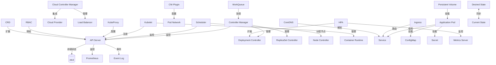

# Kubernetes 核心架构与组件关系

## 1. 控制平面 (Control Plane) 组件关系图

## 2. 核心组件说明

### 控制平面 (Control Plane)

- **API Server**: 集群的入口，处理所有 REST 请求
- **etcd**: 分布式键值存储，保存集群所有数据
- **Controller Manager**: 运行控制器进程
- **Scheduler**: 负责 Pod 的调度
- **Cloud Controller Manager**: 与云服务商交互

### 节点组件 (Node Components)

- **Kubelet**: 管理 Pod 和容器
- **Kube Proxy**: 维护网络规则
- **Container Runtime**: 运行容器的软件（如 containerd）

### 插件 (Add-ons)

- **CNI**: 容器网络接口
- **CoreDNS**: 集群 DNS 服务
- **Metrics Server**: 资源监控
- **Ingress Controller**: 管理外部访问

## 3. 数据流向

1. **用户请求**：`kubectl` 或 API 调用发送到 API Server
2. **认证授权**：API Server 验证请求
3. **持久化**：请求被保存到 etcd
4. **控制器响应**：相关控制器检测到变化并采取行动
5. **调度**：Scheduler 分配 Pod 到节点
6. **执行**：Kubelet 创建并运行容器
7. **服务发现**：CoreDNS 更新 DNS 记录
8. **网络配置**：CNI 插件配置网络
9. **负载均衡**：kube-proxy 配置网络规则

## 4. 扩展点

- **CRD**: 自定义资源定义
- **CSI**: 容器存储接口
- **Device Plugins**: 设备插件
- **Scheduler Extender**: 调度器扩展

## 5. 监控与日志

- **Metrics**: 通过 Metrics Server 收集
- **Logs**: 容器日志通过日志驱动收集
- **Events**: 集群事件通过 API Server 记录

## 6. 安全

- **认证**：客户端证书、Bearer tokens、认证代理
- **授权**：RBAC、ABAC、Node、Webhook
- **准入控制**：MutatingAdmissionWebhook、ValidatingAdmissionWebhook

## 7. 网络模型

- **Pod 网络**：每个 Pod 分配唯一 IP
- **服务发现**：通过 DNS 或环境变量
- **网络策略**：控制 Pod 间通信

## 8. 存储

- **Volumes**: 卷挂载
- **PersistentVolumes**: 持久化存储
- **StorageClass**: 存储类

## 9. 调度

- **节点选择**：nodeSelector、nodeAffinity
- **Pod 间关系**：podAffinity、podAntiAffinity
- **污点与容忍**：Taints and Tolerations

## 10. 自动扩缩

- **HPA**: 水平 Pod 扩缩
- **VPA**: 垂直 Pod 扩缩
- **CA**: 集群自动扩缩
